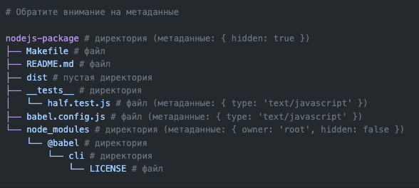

# Абстракции. Практика с immutable fs-trees.

Задача реализовать github репозиторий с index.js файлом, который создаёт с помощью библиотеки дерево с такой же структурой и выводит его на экран через сonsole.log.

Ваш код должен создавать такую иерархию и выводить на экран полученный результат. 
